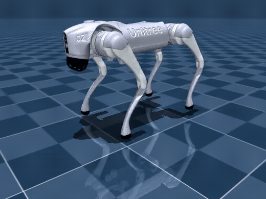

# Go2 Backflip RL

Unitree Go2 사족보행 로봇의 백플립(backflip) 강화학습.
Reference-free 보상 설계 + 커리큘럼 학습. Isaac Sim(PhysX) 학습 → MuJoCo 검증·재학습.

<p align="center">
  
</p>

## 성능 (MuJoCo 실측)

| 지표 | 값 |
|---|---|
| 회전각 | 359.5° (오차 0.081 rad) |
| 착지 충격 | 194 N (체중 1.3배) |
| 착지 위치 오차 | 0.094 m |
| 점프 최고점 | 0.78 m |

## 구성

- **시뮬레이터**: Isaac Sim 4.5 / IsaacLab 2.3 (학습, 8192 envs) · MuJoCo 3.10 (검증·재학습, 128 envs)
- **알고리즘**: PPO (rsl_rl) · MLP [512, 256, 128] · asymmetric actor-critic
- **관측**: 정책 43차원 (각속도 3, 중력벡터 3, 관절각 12, 관절속도 12, 이전행동 12, phase 1) / 크리틱 51차원 (+선속도 3, 발접촉 4, 높이 1)
- **행동**: 관절 목표각 오프셋 12차원, 50 Hz
- **제어**: τ = 25·(q* − q) − 0.5·q̇, DC모터 속도-토크 곡선 (포화 23.5 N·m, 속도한계 30 rad/s), 물리 200 Hz
- **에피소드**: 2.0 s = 준비 [0, 0.5) · 도약 [0.5, 0.75) · 회전 [0.5, 1.0) · 착지 [1.0, 2.0]

## 보상함수

R(s,a) = Σ wᵢ·rᵢ · dt. phase φ = t/T는 관측에 포함 (Markov 성질 보존).

| 항 | 수식 | 가중치 |
|---|---|---|
| r_up | `clip(v_z, 0, 3.0) · 𝟙[φ∈Φ_up]` | +20.0 |
| r_flip | `clip(−ω_y, 0, ω_max) · 𝟙[φ∈Φ_flip]` | +5.0 |
| r_land | `𝟙[네발접지 ∧ 수평 ∧ \|pitch_int+2π\|<0.3] · 𝟙[φ∈Φ_land]` | +10.0 |
| r_ori | `−(pitch_int − θ_ref(φ))²`, θ_ref: 0 → −2π 램프 | −1.0 |
| r_height | `−\|h − 0.3\| · 𝟙[φ∉Φ_flip]` | −10.0 |
| r_roll | `−\|g_y\|` | −10.0 |
| r_yaw | `−ω_z²` | −1.0 |
| r_feet_pre | `−Σ clip(h_feet − 0.03, 0) · 𝟙[φ∈Φ_prep]` | −30.0 |
| r_sym | `−‖a_L·M − a_R‖²` (M: 힙 부호 반전) | −0.1 |
| r_feet_dist | `−(\|d_front − 0.3\| + \|d_rear − 0.3\|)` | −1.0 |
| r_rate | `−‖a_t − a_{t−1}‖²` | −0.001 |
| r_limit | 관절 소프트한계 초과분 | −10.0 |
| r_contact | 몸통·허벅지 접촉 | −1.0 |
| r_torque | `−‖τ‖²` | −5e-4 |
| r_acc | `−‖q̈‖²` | −1e-6 |
| r_drift | `−‖p_xy − p₀‖² · 𝟙[φ∈Φ_land]` | −5.0 |
| r_impact | `−Σ clip(F_feet − 250 N, 0)` | −0.3 |

전 항목 `reward_overrides.json` 편집으로 학습 중 실시간 변경 가능.

## 커리큘럼

이전 체크포인트(정책 + Adam 상태) warm-start. 보상 항은 고정, 아래 설정만 전환.

| Stage | 내용 | 설정 | 승급 기준 |
|---|---|---|---|
| 1 | 수직 점프 | r_flip=0 · r_ori=0 · 수평유지 −5.0 | up_vel ≥ 5.0 |
| 2 | 후방 180° | ω_max 3.6 · θ_ref → π · 몸통접촉 −0.1 | 회전각 ≤ −2.8 rad |
| 3 | 풀 백플립 | ω_max 7.2 · θ_ref → 2π · 몸통접촉 −1.0 | 회전각 ≤ −5.9 rad |
| 4 | 강건화 | DR: 마찰 0.5–1.25 · 질량 ±1 kg · 무게중심 ±3 cm · Kp/Kd ±10% · r_torque/r_acc/r_land 활성 | 완주 (2000 iter) |
| 5 | 정밀·연착지 | r_drift · r_impact 활성 · 리셋 랜덤화 (높이 ±5 cm, 관절 ±0.1 rad) | 완주 |

승급 판정은 실측 물리량(자이로 적산 회전각) 기준, 3회 연속 충족 시 자동 진행.

### sim2real
관측 노이즈 (관절각 ±0.01 rad · 각속도 ±0.2 rad/s · 관절속도 ±1.5 rad/s) · 행동 지연 0~10 ms · 모터 오프셋 ±0.02 rad · 선속도 관측 제외 · CMDP 충격 하드제약 700 N (Stage 6, 옵션)

## 실행

### Isaac Sim 학습
```bash
ISAAC_PY=~/isaac-sim-4.5.0/python.sh
$ISAAC_PY -m pip install -e .
$ISAAC_PY scripts/rsl_rl/train.py --task Isaac-Backflip-Go2-Stage1-Direct-v0 \
  --headless --num_envs 8192 --max_iterations 1000
# Stage 2~5: --task 변경 + --resume
```

### MuJoCo 검증·재학습
```bash
python3 -m venv .venv-mj
.venv-mj/bin/pip install mujoco onnxruntime "imageio[ffmpeg]" numpy tensorboard rsl-rl-lib==3.0.1 tensordict
.venv-mj/bin/pip install torch --index-url https://download.pytorch.org/whl/cpu
git clone --depth 1 --filter=blob:none --sparse https://github.com/google-deepmind/mujoco_menagerie.git
cd mujoco_menagerie && git sparse-checkout set unitree_go2 && cd ..

# 검증 (제공된 정책으로 즉시 실행 가능)
MUJOCO_GL=egl .venv-mj/bin/python scripts/sim2sim_mujoco.py \
  --onnx policy/policy_soft3.onnx --video backflip.mp4

# 재학습
.venv-mj/bin/python scripts/mujoco_finetune.py \
  --checkpoint policy/model_6594.pt --num_envs 128 --iterations 300
```

### 프레임 실측
```bash
$ISAAC_PY scripts/rsl_rl/capture.py --task Isaac-Backflip-Go2-Stage5-Direct-v0 \
  --headless --num_envs 4 --steps 200 --checkpoint <ckpt> --out capture.csv
```

## 구조

```
├── source/go2_backflip/          # IsaacLab 외부 확장 (환경·보상·커리큘럼 cfg)
├── scripts/
│   ├── rsl_rl/train.py, play.py  # 학습 / 재생
│   ├── rsl_rl/capture.py         # 50Hz 프레임 실측
│   ├── sim2sim_mujoco.py         # MuJoCo 검증
│   ├── mujoco_finetune.py        # MuJoCo 재학습
│   └── export_mj_onnx.py         # 체크포인트 → ONNX
├── policy/                       # 최종 정책 (ONNX + 체크포인트)
├── media/                        # 영상
└── docs/                         # 발표자료
```

## 참고

[Genesis-backflip](https://github.com/ziyanx02/Genesis-backflip) · [Curriculum-Based RL for Quadrupedal Jumping](https://arxiv.org/abs/2401.16337) · [IsaacLab](https://github.com/isaac-sim/IsaacLab) · [rsl_rl](https://github.com/leggedrobotics/rsl_rl) · [mujoco_menagerie](https://github.com/google-deepmind/mujoco_menagerie)
